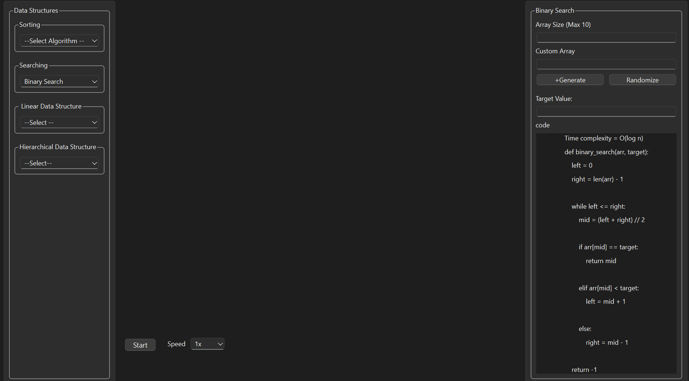
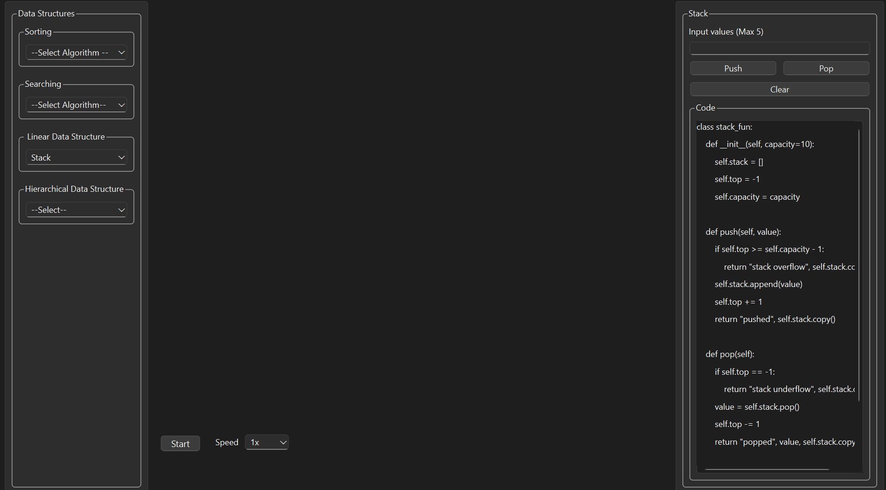
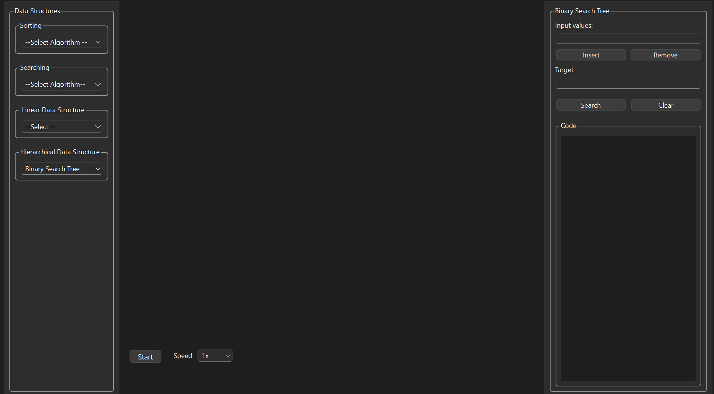

# DSA-Visualizer
<b>Learning</b> Data structures and algorithms in theory can be really challenging so, we have built <b>DSA-Visualizer.<br>
It is an interactive Data Structures and Algorithm visualizer built using PyQt for making learning easier through visualization.

### UI Interface
<p align ="center">

</p>


## Features
- Interactive visualization of Data Structures and Algorithms
- Step-by-step execution
- Both random and custom array generation
- Individual visualization for each data structure
- Respective code display for each algorithm

## Algorithms included:
- Sorting Algorithms
  - Bubble Sort
  - Selection Sort
  - Insertion Sort
  - Merge Sort
    
  
- Searching Algorithms
  - Linear Search
  - Binary Search
 
    
  


### Linear Data Structures
- Linked List
- Stack
- Queue

  

  
### Hierarchical Data structures
#### Tree
- Binary Search Tree
   
#### Graph
- Breadth First Search (BST)
- Depth First Search (DFS)

---

## ⚙️ Installation & Setup

1. **Clone the Repository:**
   ```bash
   git clone [https://github.com/yourusername/dsa-visualizer-pyqt.git](https://github.com/yourusername/dsa-visualizer-pyqt.git)
   cd dsa-visualizer-pyqt
   ```
2. **Create Virtual Environment:**<br>
   `python -m venv venv`
   
  * Windows:<br>
  `venv\Scripts\activate`
  * macOS/Linux:<br>
  `source venv/bin/activate`
  
2. **Install Dependencies**<br>
   `pip install PyQt6`

4. **Run the Application:**<br>
   `python main.py`
