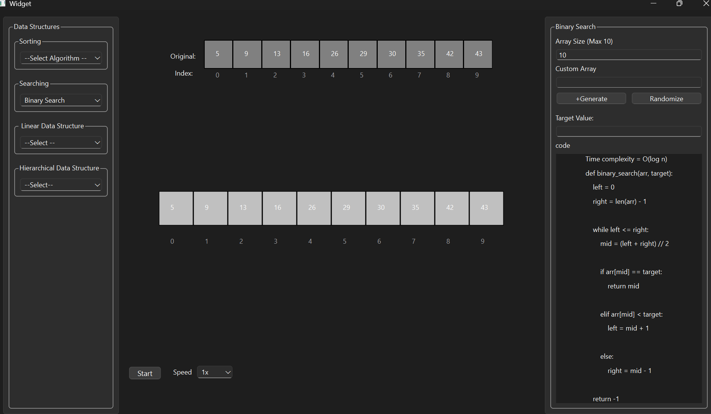

# DSA-Visualizer
<b>Learning</b> Data structures and algorithms in theory can be really challenging so, we have built <b>DSA-Visualizer. 
It is an interactive Data Structures and Algorithm visualizer built using PyQt for making learning easier through visualization.

### UI Interface

## Features
- Interactive visualization of Data Structures and Algorithms
- Step-by-step execution
- Both random and custom array generation
- Individual visualization for each data structure
- Respective code display for each algorithm

## Algorithms included:
- Sorting Algorithms
  - Bubble Sort
  - Selection Sort
  - Insertion Sort
  - Merge Sort
    
  
- Searching Algorithms
  - Linear Search
  - Binary Search
  

### Linear Data Structures
- Linked List
- Stack
- Queue
  
### Hierarchical Data structures
- Binary Search Tree
